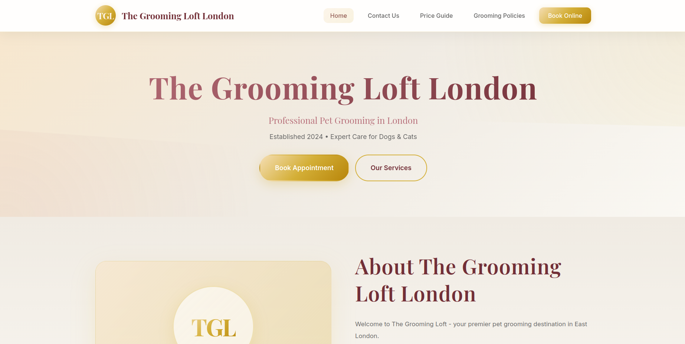

# The Grooming Loft — Booking System

A pet grooming booking system built for a local salon. Customers can view available slots and book appointments online, with instant Telegram notifications sent to the salon owner on each new booking.

> **Live site:** [thegroomingloft.co.uk](https://www.thegroomingloft.co.uk)



## Tech Stack

- **Backend:** FastAPI (Python), async SQLAlchemy, PostgreSQL
- **Frontend:** HTML, CSS, JavaScript
- **Notifications:** Telegram Bot API
- **Deployment:** AWS Elastic Beanstalk, AWS RDS

## Getting Started

```bash
pip install -r requirements.txt
uvicorn main:app --reload
```

## Environment Variables

```env
DATABASE_URL=
TELEGRAM_BOT_TOKEN=
TELEGRAM_CHAT_ID=
```

## API Endpoints

- `GET /health` — Health check
- `GET /available-slots` — Get available slots for a given date and service
- `POST /bookings` — Create a new booking and send Telegram notification
